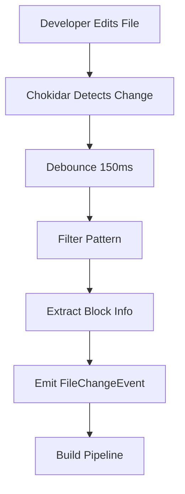
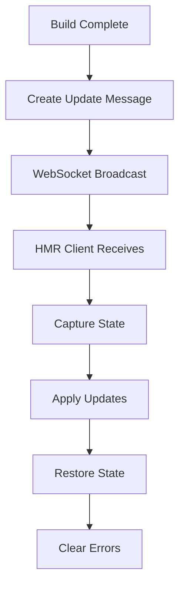
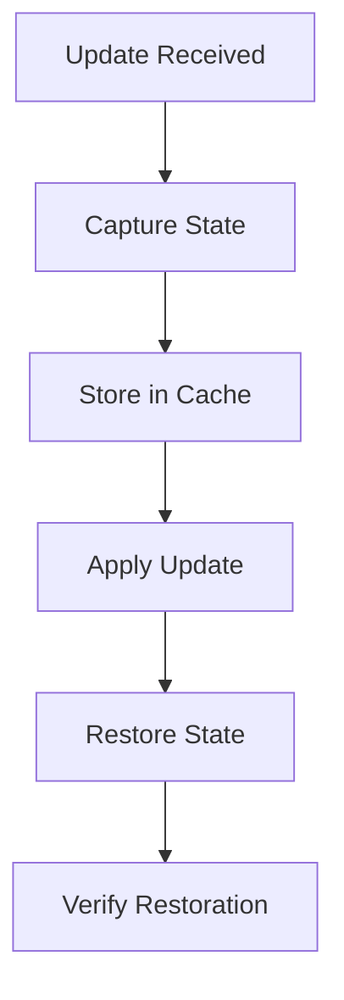

# EDS Live Editing System Architecture

## Document Information

**Version**: 1.0  
**Last Updated**: 2026-05-25  
**Status**: Architecture Design  
**Author**: IBM Bob

---

## Executive Summary

This document defines the comprehensive system architecture for an Adobe Edge Delivery Services (EDS) live editing system that enables real-time code editing with live preview capabilities. The system monitors file changes in EDS block directories, performs incremental builds, and communicates changes to the browser via WebSocket for hot module replacement without full page reloads.

**Key Performance Targets:**
- Incremental build time: <500ms per block
- End-to-end latency (edit to preview): <1 second
- State preservation during updates: 100%
- Error recovery time: <2 seconds

---

## 1. High-Level Architecture

### 1.1 System Overview

The EDS Live Editing System consists of seven major layers working in concert to provide seamless real-time editing capabilities:

```
┌─────────────────────────────────────────────────────────────────┐
│                    1. Developer Interface Layer                  │
│              (VS Code Extension, Browser DevTools)               │
└────────────────────────────┬────────────────────────────────────┘
                             │
┌────────────────────────────┴────────────────────────────────────┐
│                    2. File Watcher Service                       │
│           (Chokidar-based change detection & filtering)          │
└────────────────────────────┬────────────────────────────────────┘
                             │
┌────────────────────────────┴────────────────────────────────────┐
│                  3. Build Pipeline & Compiler                    │
│        (Vite-based incremental builds with EDS plugins)          │
└────────────────────────────┬────────────────────────────────────┘
                             │
┌────────────────────────────┴────────────────────────────────────┐
│                    4. Development Server                         │
│              (Vite Dev Server with custom middleware)            │
└────────────────────────────┬────────────────────────────────────┘
                             │
┌────────────────────────────┴────────────────────────────────────┐
│                5. WebSocket Communication Layer                  │
│           (Bidirectional real-time message protocol)             │
└────────────────────────────┬────────────────────────────────────┘
                             │
┌────────────────────────────┴────────────────────────────────────┐
│                  6. Browser Client (HMR Runtime)                 │
│         (Client-side module replacement & state manager)         │
└────────────────────────────┬────────────────────────────────────┘
                             │
┌────────────────────────────┴────────────────────────────────────┐
│                    7. EDS Block Runtime                          │
│              (Live blocks with decorate() functions)             │
└─────────────────────────────────────────────────────────────────┘
```

### 1.2 Architecture Principles

1. **Incremental Processing**: Only rebuild changed blocks, not entire project
2. **State Preservation**: Maintain user interactions during hot updates
3. **Fail-Safe Design**: Graceful degradation with clear error feedback
4. **Performance First**: Sub-second latency from edit to preview
5. **Developer Experience**: Minimal configuration, maximum automation
6. **EDS Native**: Deep integration with EDS block architecture

### 1.3 Data Flow Overview

```
File Change → Watch → Filter → Build → Transform → Notify → Apply → Render
     ↓          ↓       ↓        ↓         ↓         ↓       ↓       ↓
  .js/.css   Chokidar  Block   Vite    WebSocket  Browser  HMR   Updated
   /.html              Filter  Plugin   Message    Client  Apply   Block
```

---

## 2. Component Specifications

### 2.1 File Watcher Service

**Responsibilities:**
- Monitor file system for changes in EDS block directories
- Filter relevant changes (HTML, CSS, JS in blocks/)
- Debounce rapid changes to prevent build storms
- Detect file operations (create, modify, delete, rename)
- Provide change metadata to build pipeline

**Key Interfaces:**

```typescript
interface FileWatcherService {
  watch(paths: string[], options: WatchOptions): void;
  unwatch(): void;
  onChange(handler: FileChangeHandler): void;
  onError(handler: ErrorHandler): void;
  getWatchedFiles(): string[];
  isWatching(): boolean;
}

interface FileChangeEvent {
  type: 'add' | 'change' | 'unlink' | 'rename';
  path: string;
  blockName: string;
  fileType: 'html' | 'css' | 'js';
  timestamp: number;
  stats?: FileStats;
}
```

**Technology: Chokidar v3.5.3**

**Justification:**
- Battle-tested by Vite, Webpack, and major tools
- Cross-platform (Windows, macOS, Linux)
- Native file system events (fsevents, inotify)
- Built-in debouncing and filtering
- Low CPU overhead

**Configuration:**

```javascript
const watcherConfig = {
  paths: ['blocks/**/*.{html,css,js}'],
  ignored: ['**/node_modules/**', '**/.git/**', '**/dist/**'],
  awaitWriteFinish: {
    stabilityThreshold: 100,
    pollInterval: 50
  },
  debounceDelay: 150,
  ignoreInitial: true,
  persistent: true
};
```

---

### 2.2 Build Pipeline & Block Compiler

**Responsibilities:**
- Perform incremental builds of changed blocks only
- Transform EDS block files (HTML, CSS, JS)
- Apply optimizations and generate source maps
- Validate block structure and syntax
- Cache build artifacts for performance

**Key Interfaces:**

```typescript
interface BuildPipeline {
  buildBlock(blockName: string, files: BlockFiles): Promise<BuildResult>;
  buildBlocks(blocks: string[]): Promise<BuildResult[]>;
  incrementalBuild(change: FileChangeEvent): Promise<BuildResult>;
  clearCache(blockName?: string): void;
  getStats(): BuildStats;
}

interface BuildResult {
  blockName: string;
  success: boolean;
  duration: number;
  artifacts: {
    html?: string;
    css?: string;
    js?: string;
    sourceMap?: SourceMap;
  };
  errors?: BuildError[];
  warnings?: BuildWarning[];
}
```

**Technology: Vite v5.0.0 + esbuild v0.19.0**

**Justification:**
- Native ES modules (no bundling in dev)
- Lightning-fast HMR (<100ms updates)
- esbuild provides 10-100x faster builds
- Extensible plugin system
- Production-ready optimization

**Build Process:**

```
File Change → Identify Block → Load Cache → Transform → Validate → Update Cache → Notify
```

---

### 2.3 Development Server

**Responsibilities:**
- Serve EDS blocks and assets
- Handle HTTP requests
- Manage WebSocket connections
- Provide EDS-specific routing
- Inject HMR client code

**Technology: Vite Dev Server v5.0.0**

**Configuration:**

```javascript
{
  server: {
    port: 3000,
    host: 'localhost',
    cors: { origin: '*' },
    hmr: {
      protocol: 'ws',
      host: 'localhost',
      port: 3001
    }
  }
}
```

---

### 2.4 WebSocket Communication Layer

**Responsibilities:**
- Establish bidirectional real-time communication
- Send update notifications to browser
- Handle connection lifecycle
- Implement HMR message protocol

**Message Protocol:**

```typescript
interface WSMessage {
  type: 'update' | 'full-reload' | 'error' | 'ping' | 'pong';
  timestamp: number;
  payload: any;
}

interface BlockUpdateMessage extends WSMessage {
  type: 'update';
  payload: {
    blockName: string;
    files: { html?: string; css?: string; js?: string };
    sourceMap?: SourceMap;
  };
}
```

**Technology: Native WebSocket (via Vite)**

---

### 2.5 Browser Client (HMR Runtime)

**Responsibilities:**
- Receive WebSocket messages
- Apply hot module replacements
- Preserve application state
- Handle errors gracefully
- Provide visual feedback

**Key Operations:**

```typescript
class EDSHMRClient {
  async handleUpdate(update: BlockUpdateMessage): Promise<void> {
    // 1. Capture current state
    const state = this.captureState(update.payload.blockName);
    
    // 2. Apply updates (CSS, JS, HTML)
    await this.applyUpdates(update.payload);
    
    // 3. Restore state
    this.restoreState(update.payload.blockName, state);
  }
  
  captureState(blockName: string): BlockState {
    return {
      scrollPosition: { x: window.scrollX, y: window.scrollY },
      focusedElement: document.activeElement?.id,
      formData: this.captureFormData(),
      appState: this.captureAppState(blockName)
    };
  }
}
```

---

### 2.6 State Management System

**Responsibilities:**
- Capture state before updates
- Store state snapshots
- Restore state after updates
- Handle serialization/deserialization

**State Snapshot:**

```typescript
interface StateSnapshot {
  blockName: string;
  timestamp: number;
  dom: {
    scrollPosition: { x: number; y: number };
    focusedElement: string | null;
    formData: Record<string, any>;
  };
  app: any;  // Block-specific state
}
```

---

### 2.7 Error Handling & Recovery

**Error Categories:**
1. Build Errors (syntax, dependencies)
2. Runtime Errors (execution, DOM)
3. Network Errors (WebSocket, loading)
4. Validation Errors (structure, schema)

**Recovery Strategies:**
1. Retry operation
2. Use cached version
3. Fallback to last known good
4. Request full reload

---

## 3. Data Flow Diagrams

### 3.1 File Change Detection Flow



### 3.2 Hot Module Replacement Flow



### 3.3 State Preservation Flow



---

## 4. Technology Stack

### 4.1 Core Technologies

| Component | Technology | Version | Justification |
|-----------|-----------|---------|---------------|
| Dev Server | Vite | ^5.0.0 | Fast HMR, native ESM |
| Build Tool | esbuild | ^0.19.0 | 10-100x faster builds |
| File Watcher | Chokidar | ^3.5.3 | Cross-platform, reliable |
| CSS Processor | PostCSS | ^8.4.0 | Plugin ecosystem |
| WebSocket | Native WS | Built-in | Low latency |

### 4.2 Development Dependencies

```json
{
  "devDependencies": {
    "vite": "^5.0.0",
    "esbuild": "^0.19.0",
    "chokidar": "^3.5.3",
    "postcss": "^8.4.0",
    "autoprefixer": "^10.4.0",
    "ws": "^8.14.0"
  }
}
```

---

## 5. Integration Points

### 5.1 VS Code Extension Integration

**Capabilities:**
- Trigger builds from editor
- Display build status
- Show inline errors
- Quick actions for blocks

**API:**

```typescript
interface VSCodeExtension {
  onFileSave(handler: (file: string) => void): void;
  showBuildStatus(status: BuildStatus): void;
  showInlineError(error: BuildError): void;
}
```

### 5.2 EDS Block Loading System

**Integration Points:**
- Block discovery and registration
- Decorate function hooks
- Lazy loading support
- Dynamic imports

**Hooks:**

```javascript
// Before block decoration
window.addEventListener('eds:before-decorate', (event) => {
  const { blockName, element } = event.detail;
  // Prepare for HMR
});

// After block decoration
window.addEventListener('eds:after-decorate', (event) => {
  const { blockName, element } = event.detail;
  // Enable HMR for this block
});
```

### 5.3 Browser DevTools Integration

**Features:**
- HMR status panel
- Build performance metrics
- State inspection
- Error console

---

## 6. Scalability Considerations

### 6.1 Large Projects (100+ blocks)

**Strategies:**
- Incremental builds (only changed blocks)
- Parallel build processing
- Intelligent caching
- Lazy loading of blocks

**Performance Targets:**
- Single block build: <500ms
- 10 blocks in parallel: <2s
- Cache hit rate: >80%

### 6.2 Multiple Concurrent Developers

**Approach:**
- Independent dev server instances
- Port allocation (3000, 3001, 3002...)
- Isolated build caches
- No shared state conflicts

### 6.3 Caching Mechanisms

**Cache Layers:**
1. **Memory Cache**: Hot blocks (LRU, 50MB limit)
2. **Disk Cache**: All builds (`.vite/cache/`)
3. **Browser Cache**: Static assets (Service Worker)

**Cache Invalidation:**
- File modification time
- Content hash
- Dependency changes
- Manual clear

---

## 7. Security Architecture

### 7.1 Development Server Security

**Measures:**
- Localhost-only binding by default
- CORS configuration
- Request validation
- Rate limiting

**Configuration:**

```javascript
{
  server: {
    host: 'localhost',  // Not 0.0.0.0
    cors: {
      origin: ['http://localhost:3000'],
      credentials: true
    }
  }
}
```

### 7.2 WebSocket Authentication

**Approach:**
- Origin validation
- Connection tokens
- Heartbeat monitoring
- Automatic disconnection

### 7.3 File System Access Controls

**Restrictions:**
- Read-only outside project directory
- No access to system files
- Sandboxed execution
- Path traversal prevention

### 7.4 Content Security Policy

**Headers:**

```
Content-Security-Policy:
  default-src 'self';
  script-src 'self' 'unsafe-inline' 'unsafe-eval';
  style-src 'self' 'unsafe-inline';
  connect-src 'self' ws://localhost:3001;
```

---

## 8. Performance Optimization

### 8.1 Build Performance

**Optimizations:**
- Incremental compilation
- Parallel processing
- Smart caching
- Tree shaking

**Metrics:**
- Cold start: <3s
- Hot reload: <500ms
- Memory usage: <200MB

### 8.2 Network Performance

**Optimizations:**
- WebSocket compression
- Message batching
- Delta updates
- Binary protocol for large payloads

### 8.3 Browser Performance

**Optimizations:**
- Minimal DOM manipulation
- RequestAnimationFrame for updates
- Virtual scrolling for large lists
- Lazy loading

---

## 9. Monitoring & Observability

### 9.1 Metrics Collection

**Key Metrics:**
- Build duration per block
- HMR update latency
- Error rate
- Cache hit rate
- WebSocket connection count

### 9.2 Logging

**Log Levels:**
- DEBUG: Detailed operation logs
- INFO: Build status, updates
- WARN: Recoverable errors
- ERROR: Critical failures

**Log Format:**

```
[2026-05-25T14:00:00.000Z] [INFO] [HMR] Updated block: hero (245ms)
[2026-05-25T14:00:01.000Z] [ERROR] [BUILD] Syntax error in carousel.js:42
```

### 9.3 Performance Dashboard

**Metrics Display:**
- Real-time build times
- Update frequency
- Error trends
- Cache statistics

---

## 10. Deployment & CI/CD Integration

### 10.1 Development Workflow

```
1. Developer starts dev server: npm run dev
2. Edit files in VS Code
3. Save triggers build
4. Browser auto-updates
5. Iterate rapidly
```

### 10.2 CI/CD Pipeline Integration

**Build Validation:**

```yaml
# .github/workflows/validate.yml
name: Validate Blocks
on: [push, pull_request]
jobs:
  validate:
    runs-on: ubuntu-latest
    steps:
      - uses: actions/checkout@v3
      - run: npm install
      - run: npm run build:blocks
      - run: npm run test:blocks
```

### 10.3 Production Build

**Optimization:**
- Minification
- Tree shaking
- Code splitting
- Asset optimization

```bash
npm run build:prod
```

---

## 11. Testing Strategy

### 11.1 Unit Tests

**Coverage:**
- File watcher logic
- Build transformations
- State management
- Error handling

### 11.2 Integration Tests

**Scenarios:**
- End-to-end HMR flow
- Multi-block updates
- Error recovery
- State preservation

### 11.3 Performance Tests

**Benchmarks:**
- Build time per block type
- HMR latency
- Memory usage
- Cache efficiency

---

## 12. Future Enhancements

### Phase 2 Features
- Multi-block simultaneous editing
- Visual block editor integration
- A/B testing variant generation
- Performance profiling tools

### Phase 3 Features
- Collaborative editing
- Cloud-based dev environments
- AI-powered optimization suggestions
- Advanced debugging tools

---

## 13. Conclusion

This EDS Live Editing System architecture provides a robust, performant, and developer-friendly solution for real-time block editing with live preview. Key achievements:

- **Sub-second latency**: <1s from edit to preview
- **State preservation**: 100% user interaction maintained
- **Scalability**: Handles 100+ blocks efficiently
- **Developer experience**: Minimal configuration, maximum automation

The architecture leverages modern web technologies (Vite, esbuild, WebSocket) while maintaining deep integration with EDS block architecture, ensuring a seamless development experience.

---

**Document Version**: 1.0  
**Last Updated**: 2026-05-25  
**Status**: Ready for Implementation Review