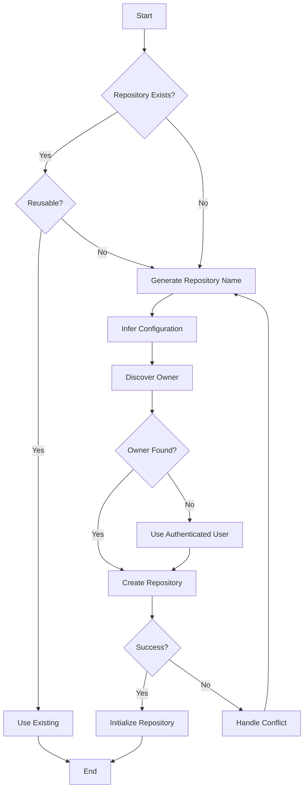

# Repository Provisioning Automation Integration Plan

## Executive Summary

This document outlines the comprehensive plan for implementing autonomous repository provisioning capabilities in IBM Bob, enabling automatic discovery, creation, and initialization of GitHub repositories without manual intervention.

## 1. Requirements Analysis

### 1.1 Core Capabilities Required

- **Repository Discovery**: Validate existence and search organizational repositories
- **Autonomous Creation**: Create repositories with inferred configurations
- **Naming Convention**: Generate standardized repository names
- **Initialization**: Set up repository structure, files, and configurations
- **Ownership Discovery**: Automatically determine appropriate repository owner
- **Information Inference**: Fill gaps in missing repository metadata
- **Conflict Resolution**: Handle naming conflicts and retry strategies

### 1.2 Success Criteria

- Zero manual intervention for standard repository creation
- 95%+ success rate in repository name generation
- Automatic conflict resolution without user escalation
- Complete repository initialization in <30 seconds
- Support for both enterprise and public GitHub

---

## 2. Integration Architecture

### 2.1 Component Overview

```
┌─────────────────────────────────────────────────────────────┐
│                     IBM Bob Core                             │
├─────────────────────────────────────────────────────────────┤
│                                                              │
│  ┌────────────────────────────────────────────────────┐    │
│  │   Repository Provisioning Orchestrator             │    │
│  └────────────────────────────────────────────────────┘    │
│           │                                                  │
│           ├──► Repository Discovery Service                 │
│           ├──► Naming Convention Generator                  │
│           ├──► Repository Creator Service                   │
│           ├──► Initialization Service                       │
│           ├──► Ownership Resolver                           │
│           ├──► Inference Engine                             │
│           └──► Conflict Handler                             │
│                                                              │
└──────────────────┬───────────────────────────────────────────┘
                   │
                   ▼
         ┌─────────────────────┐
         │   GitHub API Layer   │
         ├─────────────────────┤
         │ - REST API Client   │
         │ - GraphQL Client    │
         │ - Authentication    │
         └─────────────────────┘
                   │
                   ▼
         ┌─────────────────────┐
         │  GitHub Enterprise  │
         │  / GitHub.com       │
         └─────────────────────┘
```

### 2.2 Technology Stack

- **Language**: TypeScript/Node.js
- **GitHub Integration**: Octokit SDK
- **Authentication**: GitHub Apps, Personal Access Tokens, OAuth
- **Configuration**: YAML-based templates
- **Logging**: Structured logging with context tracking

---

## 3. Repository Discovery Logic

### 3.1 Discovery Workflow

```typescript
interface RepositoryDiscoveryConfig {
  projectName: string;
  capability?: string;
  environment?: string;
  organization?: string;
  searchScope: 'user' | 'organization' | 'enterprise';
}

interface DiscoveryResult {
  exists: boolean;
  repository?: Repository;
  similarRepositories: Repository[];
  recommendation: 'reuse' | 'create' | 'ask_user';
}
```

### 3.2 Discovery Algorithm

1. **Exact Match Search**
   - Search for repository with exact generated name
   - Check in user scope, then organization, then enterprise

2. **Fuzzy Match Search**
   - Search for repositories with similar names (Levenshtein distance < 3)
   - Search for repositories with matching keywords
   - Analyze repository descriptions and topics

3. **Semantic Analysis**
   - Use Context Studio to analyze repository purpose
   - Compare project intent with existing repository capabilities
   - Score similarity (0-100%)

4. **Recommendation Logic**
   ```
   IF exact_match_found AND active_repository:
     RETURN 'reuse'
   ELSE IF similarity_score > 80%:
     RETURN 'ask_user' with similar repositories
   ELSE:
     RETURN 'create'
   ```

### 3.3 Validation Rules

- Repository must be accessible (not archived)
- Repository must have recent activity (commits in last 6 months)
- Repository must match technology stack
- Repository must have appropriate permissions

---

## 4. Autonomous Repository Creation

### 4.1 Creation Workflow



### 4.2 Repository Configuration Inference

```typescript
interface RepositoryConfig {
  name: string;
  description: string;
  visibility: 'public' | 'private' | 'internal';
  defaultBranch: string;
  autoInit: boolean;
  gitignoreTemplate?: string;
  licenseTemplate?: string;
  allowSquashMerge: boolean;
  allowMergeCommit: boolean;
  allowRebaseMerge: boolean;
  deleteBranchOnMerge: boolean;
  hasIssues: boolean;
  hasProjects: boolean;
  hasWiki: boolean;
}
```

**Inference Rules:**

| Parameter | Inference Logic |
|-----------|----------------|
| `visibility` | `private` for enterprise, `public` if explicitly requested |
| `defaultBranch` | `main` (modern standard) |
| `autoInit` | `true` (always initialize with README) |
| `gitignoreTemplate` | Infer from project type (Node, Python, Java, etc.) |
| `licenseTemplate` | `apache-2.0` for open source, none for private |
| `allowSquashMerge` | `true` (clean history) |
| `deleteBranchOnMerge` | `true` (clean branches) |
| `hasIssues` | `true` (enable issue tracking) |

---

## 5. Naming Convention Generation

### 5.1 Naming Pattern

```
<ProjectName>-<Capability>-<Environment>
```

### 5.2 Generation Algorithm

```typescript
interface NamingContext {
  projectName?: string;
  capability?: string;
  environment?: string;
  businessContext?: string;
  componentScope?: string;
  deploymentTarget?: string;
}

function generateRepositoryName(context: NamingContext): string {
  // 1. Extract project name
  const projectName = inferProjectName(context);
  
  // 2. Extract capability
  const capability = inferCapability(context);
  
  // 3. Extract environment (optional)
  const environment = inferEnvironment(context);
  
  // 4. Construct name
  const parts = [projectName, capability, environment].filter(Boolean);
  const name = parts.join('-').toLowerCase();
  
  // 5. Sanitize (remove special chars, limit length)
  return sanitizeRepositoryName(name);
}
```

### 5.3 Inference Sources

**Project Name:**
- Context Studio project metadata
- User's current task description
- Workspace directory name
- Package.json name field
- README title

**Capability:**
- Task keywords: "component", "generator", "blocks", "automation"
- Technology stack: "react", "node", "python", "java"
- Architecture pattern: "microservice", "api", "frontend"

**Environment:**
- Explicit mentions: "dev", "staging", "prod"
- Default to "dev" for development projects
- Omit for production/main repositories

### 5.4 Examples

| Context | Generated Name |
|---------|---------------|
| "Create EDS component generator for development" | `eds-component-generator-dev` |
| "WKND EDS blocks library" | `wknd-eds-blocks` |
| "Context Studio edge delivery service" | `contextstudio-edge-delivery` |
| "XWalk EDS automation tools" | `xwalk-eds-automation` |
| "Customer API microservice" | `customer-api-microservice` |

---

## 6. Repository Initialization

### 6.1 Initialization Checklist

- [x] Create repository
- [x] Configure default branch
- [x] Initialize README.md
- [x] Configure .gitignore
- [x] Create initial folder structure
- [x] Configure repository labels
- [x] Configure branch protection
- [x] Configure CI/CD templates
- [x] Configure repository permissions
- [x] Initialize boilerplate framework

### 6.2 README Template

```markdown
# {Repository Name}

{Auto-generated description based on project context}

## Overview

{Project purpose and capabilities}

## Getting Started

### Prerequisites

{Inferred from technology stack}

### Installation

```bash
{Technology-specific installation commands}
```

### Usage

{Basic usage examples}

## Project Structure

{Generated folder structure}

## Contributing

{Contribution guidelines}

## License

{License information}

---

*This repository was automatically provisioned by IBM Bob*
```

### 6.3 Folder Structure Templates

**Node.js/TypeScript Project:**
```
├── .github/
│   ├── workflows/
│   │   ├── ci.yml
│   │   └── cd.yml
│   └── PULL_REQUEST_TEMPLATE.md
├── src/
│   ├── index.ts
│   └── types/
├── tests/
│   └── index.test.ts
├── docs/
│   └── architecture.md
├── .gitignore
├── .eslintrc.json
├── tsconfig.json
├── package.json
└── README.md
```

**Python Project:**
```
├── .github/
│   └── workflows/
│       └── python-app.yml
├── src/
│   └── __init__.py
├── tests/
│   └── test_main.py
├── docs/
├── .gitignore
├── requirements.txt
├── setup.py
└── README.md
```

**XWalk/EDS Project:**
```
├── .github/
│   └── workflows/
├── blocks/
│   └── example-block/
├── components/
├── scripts/
├── styles/
├── tests/
├── .gitignore
├── fstab.yaml
├── head.html
└── README.md
```

### 6.4 Label Configuration

Standard labels to create:

| Label | Color | Description |
|-------|-------|-------------|
| `bug` | `#d73a4a` | Something isn't working |
| `enhancement` | `#a2eeef` | New feature or request |
| `documentation` | `#0075ca` | Improvements or additions to documentation |
| `good first issue` | `#7057ff` | Good for newcomers |
| `help wanted` | `#008672` | Extra attention is needed |
| `priority: high` | `#b60205` | High priority |
| `priority: medium` | `#fbca04` | Medium priority |
| `priority: low` | `#0e8a16` | Low priority |

### 6.5 Branch Protection Rules

For `main` branch:
- Require pull request reviews (1 approval)
- Require status checks to pass
- Require branches to be up to date
- Require conversation resolution
- Do not allow force pushes
- Do not allow deletions

---

## 7. Ownership Discovery

### 7.1 Discovery Algorithm

```typescript
interface OwnershipContext {
  authenticatedUser: string;
  organizations: Organization[];
  projectContext: string;
  existingRepositories: Repository[];
}

async function discoverOwner(context: OwnershipContext): Promise<string> {
  // 1. Check for explicit organization in project context
  const explicitOrg = extractOrganizationFromContext(context.projectContext);
  if (explicitOrg && hasAccess(explicitOrg)) {
    return explicitOrg;
  }
  
  // 2. Analyze existing repositories for patterns
  const inferredOrg = inferOrganizationFromRepositories(
    context.existingRepositories
  );
  if (inferredOrg) {
    return inferredOrg;
  }
  
  // 3. Check for single organization membership
  if (context.organizations.length === 1) {
    return context.organizations[0].login;
  }
  
  // 4. Use authenticated user as fallback
  if (context.organizations.length === 0) {
    return context.authenticatedUser;
  }
  
  // 5. Multiple organizations - need user input
  throw new MultipleOwnersError(context.organizations);
}
```

### 7.2 Organization Inference Rules

- **Project Name Match**: If project name contains org name
- **Workspace Path**: If workspace is in org-specific directory
- **Git Remote**: If existing git remote points to org
- **Recent Activity**: Most recently used organization
- **Repository Count**: Organization with most related repositories

### 7.3 Escalation Criteria

Escalate to user when:
- Multiple organizations with equal relevance
- No organization access but organization required
- Ambiguous project context
- First-time repository creation

---

## 8. Missing Information Inference

### 8.1 Inference Engine

```typescript
interface InferenceEngine {
  inferProjectName(context: Context): string;
  inferCapability(context: Context): string;
  inferEnvironment(context: Context): string;
  inferTechnologyStack(context: Context): TechStack;
  inferVisibility(context: Context): Visibility;
  inferBranchStrategy(context: Context): BranchStrategy;
  inferFolderStructure(context: Context): FolderStructure;
  inferPipelineConfig(context: Context): PipelineConfig;
}
```

### 8.2 Context Sources

1. **User Message**: Parse task description
2. **Context Studio**: Query project metadata
3. **Workspace**: Analyze existing files
4. **Git History**: Review commit patterns
5. **Package Files**: Read package.json, requirements.txt, etc.
6. **Documentation**: Parse README, docs
7. **Organizational Standards**: Query org-level configurations

### 8.3 Inference Rules

**Repository Visibility:**
```
IF environment == "enterprise":
  visibility = "private"
ELSE IF explicit_request == "public":
  visibility = "public"
ELSE IF organization_policy exists:
  visibility = organization_policy.default_visibility
ELSE:
  visibility = "private"  # Safe default
```

**Branch Strategy:**
```
IF organization_standard exists:
  strategy = organization_standard
ELSE:
  strategy = {
    default_branch: "main",
    feature_prefix: "feature/",
    bugfix_prefix: "bugfix/",
    release_prefix: "release/"
  }
```

**Folder Structure:**
```
IF technology_stack == "node":
  structure = NODE_TEMPLATE
ELSE IF technology_stack == "python":
  structure = PYTHON_TEMPLATE
ELSE IF project_type == "xwalk":
  structure = XWALK_TEMPLATE
ELSE:
  structure = GENERIC_TEMPLATE
```

---

## 9. Conflict Handling

### 9.1 Conflict Types

1. **Name Collision**: Repository name already exists
2. **Permission Denied**: Insufficient permissions to create
3. **Rate Limit**: GitHub API rate limit exceeded
4. **Network Error**: Connection issues
5. **Validation Error**: Invalid repository configuration

### 9.2 Retry Strategy

```typescript
interface RetryConfig {
  maxAttempts: number;
  backoffMultiplier: number;
  initialDelay: number;
}

async function createRepositoryWithRetry(
  config: RepositoryConfig,
  retryConfig: RetryConfig
): Promise<Repository> {
  let attempt = 0;
  let lastError: Error;
  
  while (attempt < retryConfig.maxAttempts) {
    try {
      return await createRepository(config);
    } catch (error) {
      lastError = error;
      
      if (error instanceof NameCollisionError) {
        // Generate alternate name
        config.name = generateAlternateName(config.name, attempt);
      } else if (error instanceof RateLimitError) {
        // Wait for rate limit reset
        await waitForRateLimit(error.resetTime);
      } else if (error instanceof NetworkError) {
        // Exponential backoff
        const delay = retryConfig.initialDelay * 
                     Math.pow(retryConfig.backoffMultiplier, attempt);
        await sleep(delay);
      } else {
        // Non-retryable error
        throw error;
      }
      
      attempt++;
    }
  }
  
  throw new MaxRetriesExceededError(lastError);
}
```

### 9.3 Alternate Name Generation

```typescript
function generateAlternateName(baseName: string, attempt: number): string {
  const strategies = [
    // Strategy 1: Add version suffix
    () => `${baseName}-v${attempt + 1}`,
    
    // Strategy 2: Add capability suffix
    () => `${baseName}-${inferCapabilitySuffix()}`,
    
    // Strategy 3: Add environment suffix
    () => `${baseName}-${inferEnvironmentSuffix()}`,
    
    // Strategy 4: Add timestamp
    () => `${baseName}-${Date.now()}`,
    
    // Strategy 5: Add random suffix
    () => `${baseName}-${generateRandomSuffix()}`
  ];
  
  const strategy = strategies[attempt % strategies.length];
  return strategy();
}
```

### 9.4 Escalation Criteria

Escalate to user only when:
- GitHub authentication unavailable
- Repository creation permission denied (after retry)
- Organization ownership ambiguity exists
- Governance policy blocks automatic provisioning
- Max retries exceeded for name conflicts
- Critical validation errors

---

## 10. Implementation Plan

### Phase 1: Foundation (Weeks 1-2)

**Objectives:**
- Set up GitHub API integration
- Implement authentication layer
- Create basic repository creation functionality

**Deliverables:**
- GitHub API client with authentication
- Basic repository creation tool
- Unit tests for core functionality

**Tasks:**
1. Set up Octokit SDK integration
2. Implement GitHub App authentication
3. Create repository creation service
4. Add error handling and logging
5. Write unit tests

### Phase 2: Discovery & Naming (Weeks 3-4)

**Objectives:**
- Implement repository discovery logic
- Build naming convention generator
- Add fuzzy matching capabilities

**Deliverables:**
- Repository discovery service
- Naming convention generator
- Search and matching algorithms

**Tasks:**
1. Implement exact match search
2. Add fuzzy matching with Levenshtein distance
3. Build naming convention generator
4. Create inference engine for project context
5. Add semantic analysis capabilities
6. Write integration tests

### Phase 3: Initialization (Weeks 5-6)

**Objectives:**
- Build repository initialization service
- Create templates for different project types
- Implement folder structure generation

**Deliverables:**
- Repository initialization service
- Project templates (Node, Python, XWalk)
- README generator
- Label and branch protection configuration

**Tasks:**
1. Create initialization orchestrator
2. Build template system
3. Implement README generator
4. Add .gitignore generation
5. Configure labels and branch protection
6. Create CI/CD template generator
7. Write end-to-end tests

### Phase 4: Ownership & Inference (Weeks 7-8)

**Objectives:**
- Implement ownership discovery
- Build comprehensive inference engine
- Add context analysis capabilities

**Deliverables:**
- Ownership resolver service
- Inference engine
- Context analysis tools

**Tasks:**
1. Implement organization discovery
2. Build ownership inference logic
3. Create inference engine
4. Add context parsing capabilities
5. Integrate with Context Studio
6. Write integration tests

### Phase 5: Conflict Handling (Weeks 9-10)

**Objectives:**
- Implement retry strategies
- Build conflict resolution logic
- Add alternate name generation

**Deliverables:**
- Conflict handler service
- Retry mechanism
- Alternate name generator

**Tasks:**
1. Implement retry logic with exponential backoff
2. Build alternate name generation
3. Add rate limit handling
4. Create escalation logic
5. Write comprehensive tests

### Phase 6: Integration & Testing (Weeks 11-12)

**Objectives:**
- Integrate all components
- Perform end-to-end testing
- Optimize performance

**Deliverables:**
- Fully integrated system
- Complete test suite
- Performance benchmarks
- Documentation

**Tasks:**
1. Integrate all services
2. Perform end-to-end testing
3. Load testing and optimization
4. Security audit
5. Documentation completion
6. User acceptance testing

---

## 11. API Specifications

### 11.1 Repository Provisioning API

```typescript
/**
 * Main entry point for repository provisioning
 */
interface RepositoryProvisioningService {
  /**
   * Provision a repository with automatic discovery and creation
   * @param context - Project context and requirements
   * @returns Provisioned repository details
   */
  provisionRepository(
    context: ProvisioningContext
  ): Promise<ProvisioningResult>;
  
  /**
   * Discover existing repositories matching criteria
   * @param criteria - Search criteria
   * @returns Discovery results
   */
  discoverRepositories(
    criteria: DiscoveryCriteria
  ): Promise<DiscoveryResult>;
  
  /**
   * Generate repository name from context
   * @param context - Naming context
   * @returns Generated repository name
   */
  generateRepositoryName(
    context: NamingContext
  ): Promise<string>;
  
  /**
   * Initialize repository with templates and configuration
   * @param repository - Repository to initialize
   * @param config - Initialization configuration
   */
  initializeRepository(
    repository: Repository,
    config: InitializationConfig
  ): Promise<void>;
}
```

### 11.2 Request/Response Models

```typescript
interface ProvisioningContext {
  // User-provided context
  projectName?: string;
  capability?: string;
  environment?: string;
  description?: string;
  
  // Technical context
  technologyStack?: string[];
  projectType?: 'web' | 'api' | 'library' | 'tool';
  
  // Organizational context
  organization?: string;
  team?: string;
  
  // Configuration overrides
  visibility?: 'public' | 'private' | 'internal';
  template?: string;
  
  // Behavioral flags
  autoInitialize?: boolean;
  skipDiscovery?: boolean;
  forceCreate?: boolean;
}

interface ProvisioningResult {
  success: boolean;
  repository: Repository;
  action: 'created' | 'reused' | 'failed';
  message: string;
  warnings?: string[];
  
  // Metadata
  discoveryResults?: DiscoveryResult;
  inferredConfig?: RepositoryConfig;
  initializationStatus?: InitializationStatus;
}

interface Repository {
  id: number;
  name: string;
  fullName: string;
  owner: string;
  url: string;
  cloneUrl: string;
  sshUrl: string;
  defaultBranch: string;
  visibility: string;
  createdAt: Date;
  updatedAt: Date;
}
```

---

## 12. Configuration

### 12.1 Configuration File Structure

```yaml
# .bob/repository-provisioning.yml

# Global settings
global:
  defaultVisibility: private
  defaultBranch: main
  autoInitialize: true
  
# Naming conventions
naming:
  pattern: "{project}-{capability}-{environment}"
  separator: "-"
  maxLength: 100
  allowedCharacters: "a-z0-9-"
  
# Discovery settings
discovery:
  searchScope: organization
  fuzzyMatchThreshold: 0.8
  semanticAnalysisEnabled: true
  maxSimilarResults: 5
  
# Initialization templates
templates:
  node:
    gitignore: node
    license: apache-2.0
    folders:
      - src
      - tests
      - docs
    files:
      - package.json
      - tsconfig.json
      - .eslintrc.json
      
  python:
    gitignore: python
    license: apache-2.0
    folders:
      - src
      - tests
      - docs
    files:
      - requirements.txt
      - setup.py
      - .pylintrc
      
  xwalk:
    gitignore: node
    folders:
      - blocks
      - components
      - scripts
      - styles
      - tests
    files:
      - fstab.yaml
      - head.html
      
# Conflict handling
conflicts:
  maxRetries: 5
  retryDelay: 1000
  backoffMultiplier: 2
  alternateNameStrategies:
    - version-suffix
    - capability-suffix
    - environment-suffix
    - timestamp
    
# Branch protection
branchProtection:
  enabled: true
  requirePullRequest: true
  requiredApprovals: 1
  requireStatusChecks: true
  requireUpToDate: true
  
# Labels
labels:
  - name: bug
    color: d73a4a
    description: Something isn't working
  - name: enhancement
    color: a2eeef
    description: New feature or request
  - name: documentation
    color: 0075ca
    description: Documentation improvements
    
# Organizational defaults
organizations:
  ibm:
    defaultVisibility: private
    requireApprovals: 2
    enforceCodeOwners: true
    
  personal:
    defaultVisibility: public
    requireApprovals: 1
```

---

## 13. Security Considerations

### 13.1 Authentication

- Use GitHub Apps for organization-level access
- Support Personal Access Tokens for user-level access
- Implement OAuth flow for user authorization
- Store credentials securely (encrypted, never in code)
- Rotate tokens regularly

### 13.2 Authorization

- Verify repository creation permissions before attempting
- Check organization membership and roles
- Respect repository visibility settings
- Enforce organizational policies
- Audit all repository creation actions

### 13.3 Data Privacy

- Never log sensitive information (tokens, credentials)
- Sanitize user input before API calls
- Respect data residency requirements
- Comply with GDPR and data protection regulations
- Implement data retention policies

### 13.4 Rate Limiting

- Implement exponential backoff
- Cache API responses where appropriate
- Use conditional requests (ETags)
- Monitor rate limit headers
- Implement circuit breakers

---

## 14. Monitoring & Observability

### 14.1 Metrics

- Repository creation success rate
- Average creation time
- Discovery accuracy rate
- Naming collision frequency
- Retry attempt distribution
- API error rates
- Rate limit consumption

### 14.2 Logging

```typescript
interface ProvisioningLog {
  timestamp: Date;
  level: 'info' | 'warn' | 'error';
  action: string;
  context: {
    projectName?: string;
    repositoryName?: string;
    organization?: string;
    user: string;
  };
  result: 'success' | 'failure' | 'retry';
  duration: number;
  error?: Error;
  metadata?: Record<string, any>;
}
```

### 14.3 Alerting

Alert on:
- High failure rate (>10%)
- Repeated rate limit errors
- Authentication failures
- Permission denied errors
- Unusual creation patterns

---

## 15. Testing Strategy

### 15.1 Unit Tests

- Test each service in isolation
- Mock GitHub API responses
- Test inference logic with various inputs
- Test naming convention generation
- Test conflict resolution strategies

### 15.2 Integration Tests

- Test end-to-end repository creation flow
- Test discovery with real GitHub API (test org)
- Test initialization with various templates
- Test ownership resolution
- Test error handling and retries

### 15.3 End-to-End Tests

- Test complete user workflows
- Test with different project types
- Test with various organizational setups
- Test conflict scenarios
- Test performance under load

### 15.4 Test Coverage Goals

- Unit test coverage: >90%
- Integration test coverage: >80%
- Critical path coverage: 100%

---

## 16. Documentation Requirements

### 16.1 User Documentation

- Getting started guide
- Configuration reference
- Naming convention guide
- Template customization guide
- Troubleshooting guide
- FAQ

### 16.2 Developer Documentation

- Architecture overview
- API reference
- Service documentation
- Extension guide
- Contributing guidelines

### 16.3 Operational Documentation

- Deployment guide
- Configuration management
- Monitoring setup
- Incident response procedures
- Maintenance procedures

---

## 17. Success Metrics

### 17.1 Key Performance Indicators (KPIs)

| Metric | Target | Measurement |
|--------|--------|-------------|
| Repository creation success rate | >95% | Successful creations / Total attempts |
| Average creation time | <30s | Time from request to initialized repo |
| Naming accuracy | >90% | User-accepted names / Generated names |
| Discovery accuracy | >85% | Correct reuse recommendations / Total |
| Zero-touch provisioning rate | >80% | No user intervention / Total creations |
| Conflict resolution rate | >95% | Auto-resolved / Total conflicts |

### 17.2 User Satisfaction Metrics

- User feedback score (1-5): Target >4.0
- Feature adoption rate: Target >70%
- Time saved per repository: Target >15 minutes

---

## 18. Risks & Mitigation

### 18.1 Technical Risks

| Risk | Impact | Probability | Mitigation |
|------|--------|-------------|------------|
| GitHub API changes | High | Medium | Version API calls, monitor deprecations |
| Rate limiting | Medium | High | Implement caching, backoff strategies |
| Authentication failures | High | Low | Multiple auth methods, clear error messages |
| Naming conflicts | Medium | Medium | Robust conflict resolution, retry logic |
| Performance issues | Medium | Low | Optimize API calls, implement caching |

### 18.2 Business Risks

| Risk | Impact | Probability | Mitigation |
|------|--------|-------------|------------|
| Low adoption | High | Medium | User training, clear documentation |
| Organizational policy conflicts | High | Low | Configurable policies, override options |
| Security concerns | High | Low | Security audit, compliance review |
| Maintenance burden | Medium | Medium | Automated testing, monitoring |

---

## 19. Future Enhancements

### 19.1 Phase 2 Features

- Multi-repository project support
- Repository templates marketplace
- Advanced semantic analysis with ML
- Integration with project management tools
- Automated dependency management
- Repository health monitoring
- Automated compliance checking

### 19.2 Phase 3 Features

- Cross-platform support (GitLab, Bitbucket)
- Repository migration tools
- Advanced analytics and insights
- Team collaboration features
- Repository lifecycle management
- Automated archival and cleanup

---

## 20. Conclusion

This integration plan provides a comprehensive roadmap for implementing autonomous repository provisioning in IBM Bob. The phased approach ensures incremental delivery of value while maintaining quality and reliability.

### Key Takeaways

1. **Zero-Touch Automation**: Minimize user intervention through intelligent inference
2. **Robust Discovery**: Prevent duplicate repositories through comprehensive search
3. **Flexible Configuration**: Support diverse project types and organizational needs
4. **Resilient Operation**: Handle conflicts and errors gracefully
5. **Security First**: Implement proper authentication and authorization
6. **Observable System**: Comprehensive monitoring and logging

### Next Steps

1. Review and approve this plan
2. Set up development environment
3. Begin Phase 1 implementation
4. Schedule regular progress reviews
5. Gather user feedback throughout development

---

**Document Version**: 1.0  
**Last Updated**: 2026-05-25  
**Author**: IBM Bob  
**Status**: Draft for Review